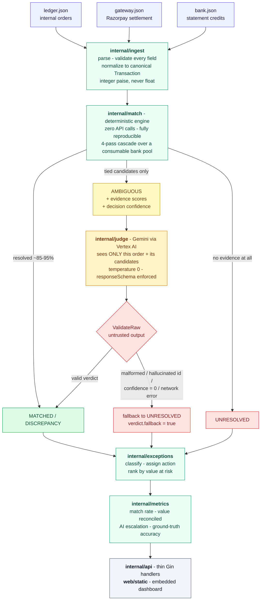

<div align="center">

# AI Finance Controller

**Three systems describe the same money differently. This proves what actually happened to it.**

A production-oriented finance reconciliation engine that ties internal ledger records,
Razorpay/gateway settlement reports, and bank statements into one provable chain —
resolving ~85–95% deterministically and escalating **only** the genuinely ambiguous
slice to an LLM.

[**Live demo →**](https://ai-finance-controller-836608396664.us-central1.run.app/)

`Go 1.26` · `Gin` · `Gemini 2.5 Flash via Vertex AI` · `Single static binary` · `Cloud Run`

</div>

---

## Table of contents

- [The problem](#the-problem)
- [What this system claims — and what it refuses to claim](#what-this-system-claims--and-what-it-refuses-to-claim)
- [Architecture](#architecture)
- [Working principles](#working-principles)
  - [1. Ingestion & normalization](#1-ingestion--normalization)
  - [2. The deterministic matching cascade](#2-the-deterministic-matching-cascade)
  - [3. Evidence scoring](#3-evidence-scoring)
  - [4. The AI judge](#4-the-ai-judge)
  - [5. The exception engine](#5-the-exception-engine)
  - [6. Metrics — four numbers, never one](#6-metrics--four-numbers-never-one)
  - [7. Human override log](#7-human-override-log)
- [Worked example: one order end to end](#worked-example-one-order-end-to-end)
- [Repository layout](#repository-layout)
- [Running it](#running-it)
- [API reference](#api-reference)
- [Deploying to Cloud Run](#deploying-to-cloud-run)
- [Engineering rules this codebase holds itself to](#engineering-rules-this-codebase-holds-itself-to)
- [Bugs found and fixed](#bugs-found-and-fixed)
- [Production path](#production-path)

---

## The problem

A single payment leaves three different fingerprints, and none of them agree on the number:

| System | Record | Amount |
|---|---|---|
| **Ledger** (internal orders) | `ORD_1001` · Amit · `PAID` | ₹10,000.00 |
| **Gateway** (Razorpay settlement) | `PAY_1001` → `ST_501` · fee ₹180, tax ₹32 | net ₹9,788.00 |
| **Bank** (statement credit) | `UTR ABC123` · "RAZORPAY PAY_1001" | ₹9,788.00 |

Multiply by fee/tax deductions, 1–3 day settlement lag, batched settlements where one bank
credit covers many orders, refund adjustments, duplicate-looking credits, and outright
missing rows — and a finance controller's real question is not *"do these rows match?"* It is:

> **What happened to the money, can I prove it, what's wrong, and what should a human do next?**

Every design decision below serves that question.

---

## What this system claims — and what it refuses to claim

The product never claims *"AI reconciled everything."* It demonstrates something narrower and
more defensible:

- The **deterministic engine** reconciled everything that could be *proven* from the data.
- **AI investigated only the ambiguous residue** — currently ~2–12% of a batch, reported openly as the **AI escalation rate**. Low is the goal, not a limitation.
- The system **measured itself against known ground truth** and prints the orders it got *wrong*.
- Whatever remained unprovable is surfaced as **UNRESOLVED** — a correct, honest outcome, not a failure.

An `UNRESOLVED` ₹2,00,000 transaction is a better outcome than a *wrong* ₹2,00,000 match.
The engine is tuned for that trade-off, even when it lowers the headline match-rate number.

---

## Architecture



**The chain being proven, for every financial event:**

```
INTERNAL ORDER  →  GATEWAY PAYMENT  →  GATEWAY SETTLEMENT  →  BANK CREDIT
   ORD_1001           PAY_1001              ST_501              UTR ABC123
```

### Layering

`internal/pipeline` is the **only** place that wires the phases together
(`ingest → match → judge → exceptions → metrics`). HTTP handlers call
`pipeline.Run(ctx, cfg)`, cache the result, and write JSON — no business logic
lives in a handler, and no package below `pipeline` imports one above it.

| Layer | Package | Responsibility |
|---|---|---|
| Canonical model | `internal/models` | One `Transaction` struct all three sources normalize into |
| Ingestion | `internal/ingest` | Per-source parsers, field-level validation, error joining |
| Reconciliation | `internal/match` | 4-pass deterministic cascade, evidence scoring, rule narration |
| AI adjudication | `internal/judge` | Provider interface + the single Gemini implementation + output validation |
| Business rules | `internal/exceptions` | Category → action mapping, value-at-risk ranking |
| Measurement | `internal/metrics` | The four rates + ground-truth scoring and miss list |
| Orchestration | `internal/pipeline` | Wires the above; order trace; human-decision log |
| Transport | `internal/api` | Thin Gin handlers, upload handling, per-IP rate limiting |
| Data | `internal/gen`, `cmd/gen` | On-demand and frozen synthetic batch generation |
| UI | `web/static` | Dashboard, embedded into the binary via `embed.FS` |

---

## Working principles

### 1. Ingestion & normalization

Three shapes in, one shape out.

- **Money is integer paise, everywhere.** `₹10,000.50 → 1000050`. No float touches a monetary value at any point in the system — not in parsing, not in matching, not in metrics.
- **Every field is validated on ingest**: required fields present, amounts positive, fee/tax/refund non-negative, dates parseable, and a gateway-side consistency check that `net_amount == gross − fee − tax − refund`.
- **All errors in a file are joined and returned together**, not thrown one at a time — so a bad upload tells you `ledger[0] (order_id="ORD_1"): gross_amount must be positive, got -1000000` rather than making you fix rows one round-trip at a time.
- Those same validators are the **only** thing guarding the public upload endpoint. There is no upload-specific validation path to drift out of sync — a regression test asserts an uploaded malformed record produces the byte-identical error string `internal/ingest`'s own tests expect.

### 2. The deterministic matching cascade

`match.Run(batch)` walks four passes over a **consumable bank pool** — once a bank credit is
claimed by an order, no later pass can double-spend it.

| Pass | Rule | What it does | Outcome |
|---|---|---|---|
| 1 | `EXACT_REFERENCE` | Bank description carries the gateway's `payment_id` | `MATCHED`, or `DISCREPANCY` if the amount disagrees |
| 2 | `DATE_WINDOW` | Amount match within a 3-day settlement-lag window | One candidate → `MATCHED`; two or more tied → `AMBIGUOUS` |
| 3 | `BATCH_SUM` | Orders sharing a `settlement_id` whose combined expected net equals exactly one available credit | All `MATCHED` together (N:1) |
| 4 | — | Nothing left to match against | `UNRESOLVED` |

Two deliberate choices worth calling out:

**Expected net is always recomputed as `gross − fee − tax`.** The engine never trusts the
gateway's own `net_amount` or `refund_amount` field for a match decision. This is why a
refund-adjusted order correctly surfaces as a `DISCREPANCY` with a stated delta — evidence is
sufficient (the reference matched) but the arithmetic doesn't reconcile — instead of being
silently absorbed into `MATCHED`.

**Tolerance is evidence-based, never a flat delta.** A flat ±₹2,000 band works fine on small
transactions and quietly accepts a false match on a large one (₹2,00,000 vs ₹1,98,000 is *not*
"close enough"). Matching is gated on reference, fee arithmetic, and the date window instead —
which lowers the raw match-rate percentage and raises real accuracy. That is the intended
direction of the trade.

**Rule cascade narration.** Every order carries a `RuleCascade` — the ordered list of
`{rule, outcome, detail}` attempts made on it. The dashboard renders it as plain English:

```
EXACT_REFERENCE → no match: no bank credit's description carries this order's payment reference
DATE_WINDOW     → escalated: 2 candidates tied at the same amount and date window
```

Nothing about an order's fate is a black box, including before the AI is ever involved.

### 3. Evidence scoring

When Pass 2 produces tied candidates, each one is scored 0–100 by a pure function decomposed
into five independently-capped components:

| Component | Max | Signal |
|---|---|---|
| `AmountScore` | 40 | Symmetric penalty on the paise delta |
| `ReferenceScore` | 30 | Longest-common-substring similarity to the payment ID |
| `DateScore` | 15 | Continuous ratio over the tolerance window's actual hours |
| `DescriptionScore` | 10 | Descriptive signal beyond the reference |
| `UniquenessScore` | 5 | Whether this description is unique among the candidates |

The single number shown in the Gemini prompt is `round(breakdown.Total)` — never a separately
tuned value, so the compact figure and the detailed breakdown can never drift apart
(a test enforces exactly that).

**Decision confidence is a different claim from evidence score.** Two candidates scoring 70.0
and 69.4 are individually strong but collectively a *tie*. `decisionConfidence` scales the
**margin between the top two** into its own 0–100 figure, shown as its own bar. And when every
candidate's full breakdown is identical, the system says so out loud —
*"Candidates are evidentially identical — no distinguishing signal exists in the available data"* —
rather than leaving an unexplained coincidence on screen.

Fabricating a distinguishing score where the data offers no basis for one would be a lie
dressed as precision. The engine declines.

### 4. The AI judge

The LLM is a **narrow, bounded, distrusted component** — not the reconciliation engine.

**What it sees:** one ambiguous order and its tied candidates, each with real bank evidence
(amount, date, description) and its evidence-score breakdown. Never the full dataset. Never a
bare ID list.

**How it's constrained:**
- `temperature: 0` and a Vertex AI `responseSchema` requiring `decision` (enum), `matched_ids`, `reason`, `confidence`, `risk_if_wrong` — the model is *structurally* forced into shape.
- The prompt states explicitly that **UNRESOLVED is a correct answer** when evidence is insufficient, and frames the evidence score as *"one input alongside your own reasoning"*, never something to defer to.
- Retries with bounded exponential backoff on 408/429/5xx come from the official SDK's own HTTP client — not hand-rolled.

**How its output is distrusted.** `judge.ValidateRaw` is the single enforcement point and rejects:

- an unrecognized `decision` value,
- any `matched_id` outside the candidate list actually offered — **no hallucinated matches**,
- an empty `reason` or empty `risk_if_wrong`,
- `confidence` outside `(0, 1]` — note the **open** lower bound; see [Bugs found and fixed](#bugs-found-and-fixed).

Any provider error *or* validation failure degrades through one shared path to
`Verdict{Decision: UNRESOLVED, Fallback: true}`. Never a crash. Never a guessed `MATCHED`.

**`Fallback` is a first-class field, not a string prefix.** "Gemini genuinely said UNRESOLVED"
and "Gemini's answer was thrown out unread" both produce `UNRESOLVED`, so the distinction has to
be carried explicitly — otherwise the UI would have to parse reason text to tell them apart.
The dashboard uses it to show *"AI verdict rejected — deferring to manual review"* and to label
that order's source *"AI judge (unavailable)"* rather than implying the AI contributed something
useful.

**The judge is optional.** With no credentials configured, `pipeline.Config.Judge` is `nil`,
the server logs a warning at startup, and ambiguous orders report honestly as pending. Every
other part of the system works end to end.

### 5. The exception engine

Every non-`MATCHED` order is classified through a fixed category → action map:

| Category | Action | When |
|---|---|---|
| `MISSING_IN_BANK` | `ESCALATE` | No bank evidence, settlement aged past 14 days — very likely genuinely stuck |
| `STALE_SETTLEMENT` | `RECHECK` | No bank evidence yet, but the gap only just opened — may still resolve on its own |
| `POSSIBLE_DUPLICATE` | `MANUAL_REVIEW` | Tied candidates the engine refused to guess between |
| `FEE_MISMATCH` | `VERIFY_FEE` | Reference match holds, but the arithmetic leaves an unexplained delta |

Two details that matter more than they look:

**Value at risk is not "the order amount" by default.** Where a reference match already ties an
order to one specific credit, only the **unexplained delta** is genuinely in question. Where no
bank evidence exists at all — or the AI is unsure *which* credit is right — the **full expected
amount** is at risk, because none of it is accounted for. Exceptions are ranked by that figure,
not by record count: four exceptions ranked ₹6,047.02 → ₹4,893.80 → ₹4,893.80 → ₹590.30 tell a
controller where to spend the next ten minutes.

**An AI verdict of `MATCHED` on a previously-ambiguous order produces no exception at all.**
The judge found decisive evidence; that is a clean resolution, not something to flag.

`asOf` is passed in explicitly (derived from the batch's own latest settlement/credit date),
never read from the wall clock — so classification stays reproducible.

### 6. Metrics — four numbers, never one

`metrics.Compute` returns all four together, deliberately. None of them alone tells the truth.

| Metric | Measures | Why it can't stand alone |
|---|---|---|
| **Match rate** | Count-based: orders resolved | Says nothing about *which* rupees |
| **Value reconciled** | ₹-weighted: money proven | Diverges from match rate — that divergence is the point |
| **AI escalation rate** | Share the deterministic engine couldn't resolve | **Lower is better** — it's a design claim, not a performance number |
| **Ground-truth accuracy** | Measured against `ground_truth.json` | `nil` when no ground truth exists; production has none |

An `AMBIGUOUS` order with no verdict yet is counted as `PendingAICount` and excluded from the
ground-truth numerator *and* denominator. A question the judge was never asked is not a question
it got wrong.

**`GroundTruthMisses` prints the failures by name.** Every order whose terminal decision
disagreed with the truth is listed as `{order_id, expected, got}` and rendered in its own
dashboard panel. The on-demand generator deliberately emits a `CROSS_MATCH` scenario the engine
is *built to get wrong*: two orders with identical net amounts, nearby dates, reference-free
descriptions, and exactly one credit between them. The engine consumes it for the wrong order,
producing a **false `MATCHED` that raises no exception** — the silent, dangerous kind. Accuracy
lands genuinely below 100%, and the demo can point straight at it.

A benchmark you can't fail is not a benchmark.

### 7. Human override log

`POST /reconcile/orders/:id/resolve` appends `{OrderID, Action, Reason, UTR, CreatedAt}` to an
in-memory, append-only log. It is a **feedback-loop seed, not a retraining pipeline**:

- It **never mutates** the order's `match.Result` or `exceptions.Exception` — a test asserts the order's trace is byte-identical before and after logging.
- It **never moves money.** No autonomous financial action exists anywhere in this codebase.
- On an ambiguous order, "approve" is meaningless until it names *which* candidate — so the drawer renders one button per tied candidate (`Approve UTR000048`), and the endpoint validates the submitted UTR against that order's own candidate list, rejecting anything else with a 400.

---

## Worked example: one order end to end

`ORD_1050` — one half of the duplicate pair in the frozen fixtures.

```
1. INGEST      ledger ORD_1050 (gross 489380 paise) + gateway PAY_1050 (fee/tax) + 49 bank credits
                 → canonical Transactions, all money in paise

2. MATCH  P1   EXACT_REFERENCE → no match
                 no bank description carries "PAY_1050"
          P2   DATE_WINDOW     → escalated
                 UTR000048 and UTR000049 both credit 489380 on the same date
                 evidence breakdown: 60.00 / 60.00  — identical
                 decision confidence: 0  (margin 0.0 → a genuine tie)
                 note: "Candidates are evidentially identical"
                 decision: AMBIGUOUS   ← never guessed

3. JUDGE       Gemini sees ONLY ORD_1050 + those two candidates + their breakdowns
                 → returns a reasoned UNRESOLVED with confidence 0.0
                 → ValidateRaw REJECTS it (confidence must be > 0)
                 → Verdict{UNRESOLVED, Fallback: true}

4. EXCEPTION   POSSIBLE_DUPLICATE → MANUAL_REVIEW
                 value at risk: full ₹4,893.80 (no credit is proven to belong to it)

5. METRICS     counted in AI escalation; ground truth agrees it is genuinely undecidable

6. UI          exceptions table: source "AI judge (unavailable)"
               drawer: "AMBIGUOUS — pending resolution"
                       "AI verdict rejected — deferring to manual review"
                       two candidate bars, five components each, identical
                       → one Approve button per UTR, reason required
```

Six stages, and at no point does anything in the chain assert more certainty than the data
supports.

---

## Repository layout

```
razorpay_Finance_Controller/
├── CLAUDE.md                   full build log, phase by phase, with rationale
├── Dockerfile                  2-stage: golang builder → distroless/static:nonroot (43.6MB)
├── cmd/
│   ├── server/main.go          wires everything, reads $PORT, graceful SIGTERM shutdown
│   └── gen/main.go             frozen 52-record fixture generator (deterministic, no RNG)
├── internal/
│   ├── models/                 canonical Transaction struct
│   ├── ingest/                 ledger/gateway/bank parsers → validation → normalization
│   ├── match/                  4-pass deterministic engine, evidence scoring, rule cascade
│   ├── judge/                  Provider interface + Gemini/Vertex AI impl + ValidateRaw
│   ├── exceptions/             category → action classification, value-at-risk ranking
│   ├── metrics/                the four rates, ground-truth scoring, miss list
│   ├── pipeline/               orchestration, order trace, human-decision log
│   ├── gen/                    on-demand seeded batch generator (weighted scenario draw)
│   ├── api/                    thin Gin handlers, multipart upload, per-IP rate limiter
│   └── envfile/                minimal .env loader
├── web/static/                 dashboard HTML/CSS/JS, embedded via embed.FS
└── data/fixtures/              ledger.json · gateway.json · bank.json · ground_truth.json
```

**Frozen fixtures**: 52 ledger / 52 gateway / 49 bank records — 40 NORMAL, 5 DATE_LAG, 3 BATCH,
1 REFUND, 2 DUPLICATE, 1 MISSING_BANK (23% non-normal). `ground_truth.json` is kept separate,
which is what makes the accuracy claim measured rather than asserted. Regenerate with
`go run ./cmd/gen`.

---

## Running it

Requires **Go 1.26+**. No database, no message queue, no external service required to start.

```bash
go run ./cmd/server
```

Open **http://localhost:8080** and click **Run Reconciliation**. Fixtures are checked into the
repo, so this works immediately on a fresh clone with zero setup.

```bash
go test ./...      # full suite: table-driven unit tests + real-fixture cross-checks
```

### Three ways to feed it data

1. **Run Reconciliation** — the frozen 52-record fixture batch, byte-stable across runs.
2. **Generate dataset** (`50` / `100` / `250`) — a fresh seeded batch. The seed is server-side and nanosecond-derived, printed on screen next to a 3-row sample of each source, so two clicks visibly produce different data. Passing an explicit `?seed=` pins it for reproducibility.
3. **Bring your own data** — upload your own `ledger`/`gateway`/`bank` JSON (`ground_truth` optional). The unmodified ingest validators are what protect this path; a bad row comes back as a 400 with the exact row-level error.

### AI judge credentials (optional)

The deterministic engine resolves ~92% of the frozen batch on its own; the rest goes to Gemini
via Vertex AI. **The app runs correctly without any credentials.**

**With a GCP project:**

1. Copy `.env.example` → `.env`, set `GOOGLE_CLOUD_PROJECT` and `GOOGLE_CLOUD_LOCATION`.
2. Pick **one** auth path:
   - **API key** — set `GOOGLE_API_KEY`.
   - **Application Default Credentials** — leave `GOOGLE_API_KEY` unset, run `gcloud auth application-default login`. Re-run it the day you demo; cached ADC tokens expire.
3. `GEMINI_MODEL` is optional (defaults to `gemini-2.5-flash`).

**Without credentials:** the server logs a warning and disables the judge. Ambiguous orders
report as pending (`AMBIGUOUS` / `POSSIBLE_DUPLICATE`). Dashboard, exceptions, and metrics all
still work end to end. This is a legitimate mode, not a degraded one.

> **Latency note, not a bug:** `judge.JudgeAll` calls Gemini **sequentially**. A 100-order
> generated batch escalating 4 orders takes ~21 seconds end to end. That is exactly why the
> generate endpoint accepts only three preset sizes and why the dashboard shows a progress
> tracker instead of a frozen button. Bounded concurrency is a documented production-path item,
> deliberately not built here.

---

## API reference

| Method | Endpoint | Purpose |
|---|---|---|
| `GET` | `/healthz` | Always 200, independent of pipeline state — Cloud Run's probe target |
| `GET` | `/reconcile/run` | Run the full pipeline against the checked-in fixtures, cache the result |
| `POST` | `/reconcile/generate` | Generate a fresh batch (`size` ∈ `{50,100,250}`, `seed` optional) and run it |
| `POST` | `/reconcile/upload` | Multipart `ledger`/`gateway`/`bank` (+ optional `ground_truth`) — 500KB/file, rate-limited per IP |
| `GET` | `/reconcile/report` | Last cached run — **409 if none yet**, never a stale or empty 200 |
| `GET` | `/reconcile/exceptions` | Exception list from the last run, pre-sorted by value at risk |
| `GET` | `/reconcile/orders/:id` | Combined match + verdict + exception trace for one order (404 if unknown) |
| `POST` | `/reconcile/orders/:id/resolve` | Log a human decision `{action, reason, utr}` |
| `GET` | `/reconcile/orders/:id/resolutions` | Append-only human-decision log for one order, oldest first |

**Status-code semantics are deliberate.** `/upload` returns **400** on a pipeline failure, not
500: a failure there is almost always the submitter's malformed input, so the real validation
text is surfaced verbatim. `/run` and `/generate` return 500 on the same class of failure —
there, it would mean the server's own trusted data or generator is broken. A failed upload never
overwrites the previously cached report.

**Upload guardrails**, since it is the only endpoint with a real public abuse surface:
500KB per file checked *before* the file touches disk; an in-memory per-IP token bucket
(5 burst, refilling one per 30s, `429` beyond that); and shape rejection inside the ingest
validators, so nothing downstream — including any Vertex AI call — ever executes against garbage.

Generating or uploading also **clears the resolution log** — a new dataset reuses `ORD_1001`-style
numbering, and a stale human decision from the previous batch would misleadingly appear to apply.

---

## Deploying to Cloud Run

Serverless containers, not something to administer — consistent with "no infrastructure we don't
need." `GET /healthz` is the probe target; `cmd/server/main.go` reads `$PORT` and handles
`SIGTERM` via `http.Server.Shutdown` so in-flight requests finish on scale-down.

**Auth is Workload Identity, not an API key.** Grant the service account
`roles/aiplatform.user` and set only `GOOGLE_CLOUD_PROJECT`, `GOOGLE_CLOUD_LOCATION`, and
optionally `GEMINI_MODEL`. Leave `GOOGLE_API_KEY` **unset** —
`judge.NewGeminiProviderFromEnv` falls back to ADC, which on Cloud Run resolves to the attached
service account automatically. No Secret Manager entry, no long-lived credential material, no
token expiry to babysit. The API-key path remains in the codebase purely as an opt-in
local-development convenience; the security property comes from which env vars the deploy sets,
not from deleting an unused code path.

```bash
# one-time IAM grant
gcloud projects add-iam-policy-binding PROJECT_ID \
  --member="serviceAccount:PROJECT_NUMBER-compute@developer.gserviceaccount.com" \
  --role="roles/aiplatform.user"

# build + deploy from source
gcloud run deploy ai-finance-controller \
  --source . \
  --region us-central1 \
  --allow-unauthenticated \
  --set-env-vars GOOGLE_CLOUD_PROJECT=PROJECT_ID,GOOGLE_CLOUD_LOCATION=us-central1,GEMINI_MODEL=gemini-2.5-flash

# during a live demo window, avoid cold starts:
gcloud run services update ai-finance-controller --region us-central1 --min-instances=1
# afterwards:
gcloud run services update ai-finance-controller --region us-central1 --min-instances=0
```

**Known trade-off, not a bug:** all state (cached report, resolution log) is in-memory and resets
if the instance scales to zero. `--min-instances=1` avoids this being visible during a demo.
Adding a database to "fix" a reset that only matters between sessions would violate the project's
own no-unnecessary-infrastructure rule.

The container was verified locally before these steps were documented: 43.6MB image
(distroless base, `CGO_ENABLED=0` static binary — no cgo anywhere in the module), serving
`/healthz`, the embedded dashboard, and a live `/reconcile/run` from inside the container; and
`docker stop` — a real `SIGTERM`, the one signal Windows cannot deliver natively — produced the
graceful-shutdown log line, proving that path actually fires.

---

## Engineering rules this codebase holds itself to

1. Read existing code before changing it.
2. No unnecessary abstractions.
3. Business logic stays out of HTTP handlers.
4. LLM provider code stays isolated behind an interface.
5. Ingestion stays separate from reconciliation logic.
6. Money is always integer paise — never float.
7. Deterministic decisions must be reproducible: same input → same output.
8. Treat all LLM output as untrusted; validate before use.
9. **Never silently convert an ambiguous result into `MATCHED`.**
10. Add a test for every bug found.
11. `go test ./...` after every phase; the app stays runnable throughout.
12. Don't add infrastructure "because production might need it eventually."
13. Prefer a smaller correct system over a larger partially-working one.

Rules 7 and 8 are why `asOf` is injected rather than read from the clock, why the generator is
seeded, and why `ValidateRaw` exists at all. Rule 9 is why an evidentially-identical candidate
pair stays `AMBIGUOUS` forever rather than being broken by a tiebreaker the data doesn't justify.

**Not built, on purpose:** PDF/OCR ingestion, a second LLM provider, real Razorpay or bank API
integration, microservices, Kubernetes, Redis, Postgres, complex auth, and any form of autonomous
money movement.

---

## Bugs found and fixed

### Zero-confidence verdicts accepted as valid *(the headline one)*

The investigation drawer showed **"Gemini confidence: 0%"** for the duplicate pair. It looked
like a broken UI element. It wasn't a plumbing bug — a live call with raw-verdict logging
confirmed the JSON tag and the JS field access already matched, and that Gemini genuinely
returned a fully-formed, well-reasoned `UNRESOLVED` verdict with `confidence: 0.0`.

`ValidateRaw`'s range check accepted it, because `0` sits on the boundary of `[0,1]`. But a
confidence of *exactly zero* is not a meaningful estimate — it should be distrusted exactly as
much as malformed JSON. **Fix:** the valid range is now the half-open `(0, 1]`. A zero
degrades through the same fallback path as a network failure, so the order still reports
`UNRESOLVED` — it just no longer attaches a meaningless number to that claim.

**Confirmed live after shipping:** a later run against real Vertex AI hit the same
zero-confidence response, `ValidateRaw` rejected it
(`"confidence 0 is out of range (0,1]"`), and the drawer showed *"Gemini confidence
unavailable"* instead of a broken bar. Regression test added alongside the existing
out-of-range cases.

### "RAZORPAY" contains "PAY"

Building a continuous reference-similarity score (so a truncated reference lands between "exact"
and "nothing") initially handed every generic, reference-free `"RAZORPAY SETTLEMENT"` description
**11.25/30 of partial credit it hadn't earned** — because the word `RAZORPAY` itself contains the
substring `PAY`, which overlaps the start of every `PAY_xxxx` ID. Fixed by requiring the overlap
to cover at least half the payment ID's length. Caught by a table test failing against the real
fixture shape, not by inspection.

### Two parts of the drawer telling contradicting stories

A live fallback verdict produced a UI that disagreed with itself: the header read *"AMBIGUOUS —
pending resolution"* while the reasoning block quoted the internal fallback string *"falling back
to UNRESOLVED"*. Fixed by making `Verdict.Fallback` an explicit boolean rather than something the
UI infers from reason text — and then branching the drawer, the exceptions table's Source column
(*"AI judge (unavailable)"*), and the enum-leaking copy strings on it.

### A hidden drawer still intercepting clicks

The investigation drawer set `display: flex` unconditionally, which — per normal cascade rules —
overrides the browser's default `[hidden] { display: none }` UA rule once an author style
declares `display` on the same element. The hidden drawer was still laid out and swallowing
clicks meant for the **Run Reconciliation** button underneath it. Scoped to
`.drawer:not([hidden])`. Caught by a real Playwright click, not by reading the code.

### "Show more" opening the drawer as a side effect

The collapsible `<details>` inside an exception row bubbled its click to the row handler,
expanding the text *and* opening the drawer. Fixed with a `closest(".text-disclosure")` guard in
both the click and keydown paths.

---

## Production path

*Documented, deliberately not built.* The MVP is a single binary with in-memory state, which is
the correct shape for 50–1,000 records. Production would add:

- **Postgres** for canonical records, results, and a persistent audit trail
- **Async processing** for large batches, with idempotent reruns
- **Batching, caching, and bounded concurrency** on the Gemini stage — the only network-bound step, and the one that currently runs sequentially
- **`merchant_id` scoping** for multi-tenancy
- **Retry/backoff policy** surfaced as configuration rather than SDK defaults

Every money-related action stays explainable, bounded, gated, and auditable. **An LLM never
directly performs money movement** — not in the MVP, and not in the production design.

---

<div align="center">

*"We didn't optimize for making every transaction look reconciled. We optimized for knowing
which money we could prove, which we couldn't, and what the finance team should do next."*

</div>
